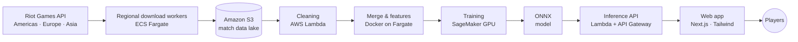

# SmartPick — AI draft assistant for League of Legends

**[smartpick.gg](https://www.smartpick.gg/)** · live since January 2026 · co-founded 2023

SmartPick tells League of Legends players which champion to pick, and why. A neural network trained on
millions of ranked matches scores every possible pick against the current draft, and an explainability layer
shows the synergies and counters behind each recommendation. Once the game starts, an LLM turns the draft
into real-time strategy advice.

> This repository is a case study. The product's source code is private and owned jointly by its three
> co-founders; this page describes what we built and how.

---

## At a glance

| | |
|---|---|
| **Traction** | ~8,000 monthly page views, growing ~30% month over month, no paid acquisition |
| **Model** | 56.7% accuracy predicting match outcomes from the draft alone, vs. a 54.5% benchmark |
| **Data** | Millions of ranked matches, refreshed from the Riot Games API across regions after every game patch |
| **Team** | 3 co-founders working after hours, plus design, gameplay and marketing contributors |
| **My role** | Co-founder & Lead Data Scientist: data pipeline, models, AWS architecture, product and team |

Predicting a match from the draft alone is hard: player skill and in-game decisions matter more than champion
choice, so every point of accuracy above the benchmark represents a real edge in pick quality.

---

## The problem

Before every ranked game, each player picks one of 170+ champions, knowing their teammates' and opponents' picks.
The choice depends on synergies with allies, counters against enemies, the current game patch and the player's role.
Existing sites show static win-rate tables; none recommend the best pick for *this* draft or explain why.

## What we built

1. **Champion recommendations.** Ranks every available champion for the player's role, given the picks made so far.
2. **Explainability.** For each recommendation, bars show how much each ally synergy and enemy counter adds or removes.
3. **Rune recommendations** (rolling out). A second model suggests the rune setup for the chosen champion and matchup.
4. **Live-game guidance.** Syncs with the player's active match and uses an LLM to generate strategy advice for that draft.

---

## Architecture

| Layer | What it does | Technology |
|---|---|---|
| **Ingestion** | Parallel workers per Riot region pull new ranked matches and refresh champion pools after each patch | Python, AWS ECS Fargate, Docker |
| **Storage** | Raw and processed match data | Amazon S3 |
| **Processing** | Clean, validate and merge matches into training sets for champion and rune models | AWS Lambda (SAM), Docker |
| **Training** | Neural networks trained as containerised jobs on GPU instances | TensorFlow / Keras, Amazon SageMaker |
| **Serving** | Models exported to ONNX and served from serverless functions for low latency and low cost | ONNX Runtime, AWS Lambda, API Gateway |
| **Front end** | Draft interface, explainability charts, accounts | Next.js, React, Tailwind CSS, AWS Amplify / Cognito |
| **DevOps** | One GitHub Actions workflow per pipeline stage builds the Docker images and deploys them, authenticating to AWS without stored keys | GitHub Actions, OIDC, Amazon ECR |

---

## The model

- **Task:** predict the probability that a team wins, given the ten champions in the draft and their roles.
- **Network:** a fully connected neural network (1024 → 512 → 128 → 32 → 4 → 1), trained with binary
  cross-entropy, a warm-up-then-decay learning-rate schedule and early stopping.
- **Recommendation:** for each champion still available, the model scores the completed draft; champions are
  ranked by their predicted win probability.
- **Explainability:** the contribution of each ally and enemy champion is quantified and shown as synergy and
  counter bars, so players see *why* a pick is recommended.
- **Benchmarks:** gradient-boosting models (XGBoost, CatBoost) and independent champion win rates served as baselines.
- **Production:** models are exported from TensorFlow to ONNX, which made inference small and fast enough for
  serverless functions. GPU training cut each training cycle from days to hours.

---

## Results

| Metric | Value |
|---|---|
| Draft-only win prediction accuracy | **56.7%** (benchmark 54.5%; first model 56.1%) |
| Public launch | 10 January 2026, after a closed beta from June 2024 |
| Monthly page views | ~8,000, growing ~30% month over month |
| Paid acquisition | None: growth is organic, via Discord, Reddit, YouTube, TikTok and Twitch streamers |
| Monetisation | Deliberately deferred until ~40,000 monthly page views, the projected break-even point |

---

## My role

**Co-founder & Lead Data Scientist** (April 2023 – present), alongside a full-time job in credit-risk modelling.

- **Data science:** designed and trained the champion and rune models, the explainability layer and the benchmarks.
- **Architecture:** designed the AWS pipeline end to end: ingestion, data lake, training, serverless inference and CI/CD.
- **Product:** set the roadmap, ran the closed beta and turned player feedback into features.
- **Team & company:** built the founding team, negotiated equity, and handled the Riot Games API agreement,
  GDPR-compliant terms and privacy policy.

## What I learned

- **Shipping beats accuracy.** The jump from a good notebook model to a fast, cheap production API (ONNX on Lambda)
  mattered more to users than the last decimal of accuracy.
- **Explainability drives trust.** A recommendation is only useful if people act on it; showing the synergy and
  counter breakdown lets players check each pick for themselves. The same principle applies to credit decisions in banking.
- **Automate the data, not just the model.** A new game patch changes the balance every two weeks; automated
  regional ingestion keeps the recommendations current without manual work.

---

**José Antonio Caballero, CFA** · [LinkedIn](https://www.linkedin.com/in/jose-antonio-caballero-diez) ·
[Other projects](https://github.com/jacaballero1241)

*SmartPick isn't endorsed by Riot Games and doesn't reflect the views or opinions of Riot Games or anyone
officially involved in producing or managing Riot Games properties. League of Legends is a trademark of
Riot Games, Inc.*
